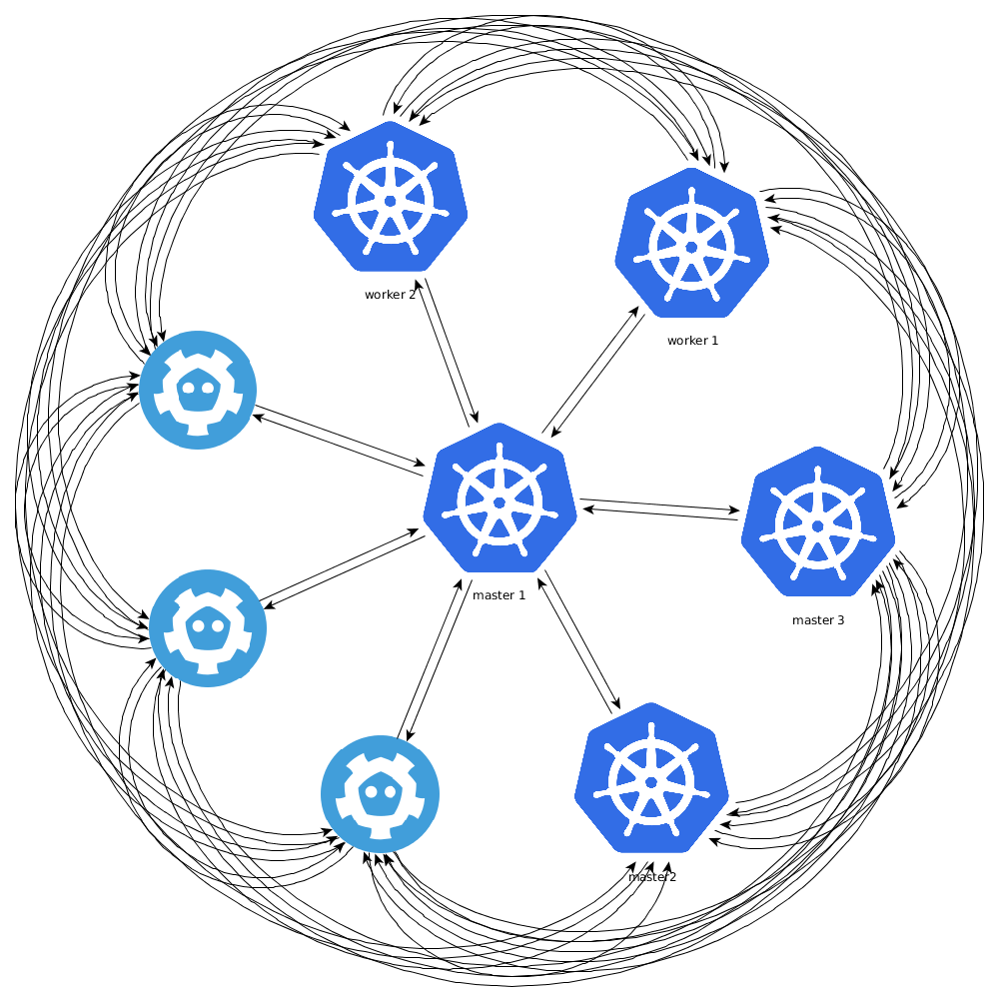
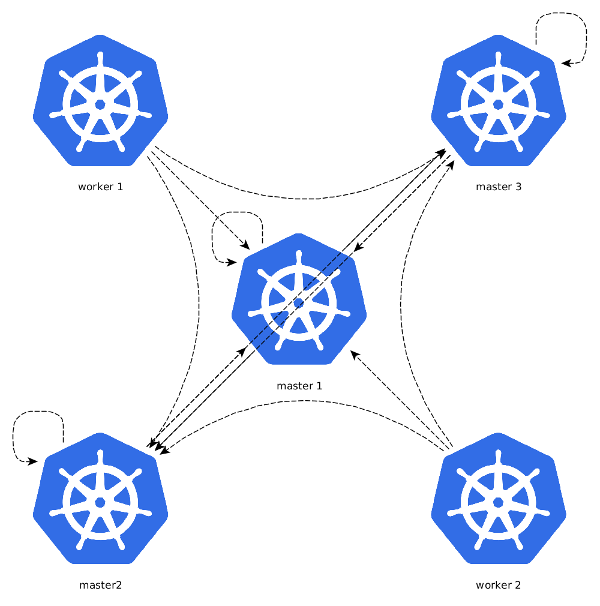

# HA clustering

Hetzner-kube supports provisioning high available (HA) clusters with the same experience as doing simple ones.

## Usage

When `--ha-enabled` is provided, hetzner-kube provisions 3 master nodes by default which run etcd and a HA kubernetes control
plane. To setup etcd outside of the cluster, `--isolated-etcd` can be passed.

You can specify different nodes count using the following flags:
- `--worker-count`, `-w`, at least 1
- `--master-count`, `-m`, at least 2 if `--isolated-etcd is passed` and at least 3 otherwise. Ignored, if no `--ha-enabled` is passed
- `--etcd-count`, `-e`, an odd number greater or equal 3. Ignored, if no `--isolated-etcd` is passed

This tool supports these levels of kubernetes HA:
- level 0: N/A 
    - you cannot create a single-node cluster (currently)
- level 1: `hetzner-kube cluster create -k XX -w 3` 
    - distinct masters and 3 workers
- level 2: N/A 
    - you cannot create a non-HA cluster with a separate etcd cluster (currently)
- level 3: `hetzner-kube cluster create -k XX -m 3 -w 3 --ha-enabled` 
    - deploys a 3 node etcd cluster and a 3-master-node cluster with 3 workers
- level 4: `hetzner-kube cluster create -k XX -e 3 -m 2 -w 3 --ha-enabled --isolated-etcd` 
    - etcd outside the k8s cluster

## Reference design

The HA-mode was designed referring to a PoC cluster with the following concepts:

### Network encryption



Hetzner-kube uses wireguard, a simple VPN with modern encryption standards to spin up a private network. 

* with etcd only node IPs like `10.0.1.1`, `10.0.1.2`, ...
* with master node IPs like `10.0.1.11`, `10.0.1.12`, ...
* with worker node IPS like `10.0.1.21`, `10.0.1.22`, ...

### Clientbased master load-balancing

There are different approaches how to solve load balancing. Hetzner-kube uses a individual load balancer for the kubernetes 
api server on each node. This is done using https://github.com/xetys/k8s-master-lb by starting it on every node using

```
# docker run -d --name master-lb --restart=always -p 16443:16443 xetys/k8s-master-lb 10.0.1.11 10.0.1.12 10.0.1.13
```



The load balancer itself is an nginx with custom rules for passive health checks. More than 1 failure in 10 seconds will 
temporary kick the failed IP from the balancer. This enables the kubernetes components to operate even if the majority of masters
are down. In fact, there is no centralized load balancer, there is no single point of failure for the components.
